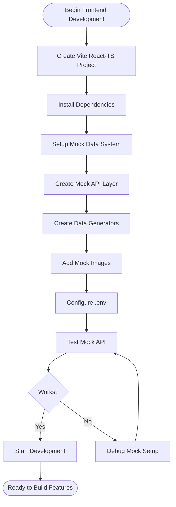

**Step-by-Step Setup:**

```bash
# 1. Create project
npm create vite@latest comic-creator-frontend -- --template react-ts
cd comic-creator-frontend

# 2. Install core dependencies
npm install zustand react-router-dom axios
npm install @tanstack/react-query

# 3. Install UI libraries
npm install tailwindcss postcss autoprefixer
npx tailwindcss init -p
npm install @radix-ui/react-dialog @radix-ui/react-dropdown-menu
npm install @radix-ui/react-toast @radix-ui/react-select
npm install lucide-react
npm install clsx tailwind-merge

# 4. Install canvas library
npm install konva react-konva
# OR
npm install fabric

# 5. Install animation
npm install framer-motion

# 6. Install rich text editor
npm install lexical @lexical/react
# OR
npm install @tiptap/react @tiptap/starter-kit

# 7. Install dev dependencies
npm install -D @faker-js/faker
npm install -D @types/node

# 8. Create folder structure
mkdir -p src/{components,stores,lib,hooks,types,pages}
mkdir -p src/lib/{api,mockData,utils}
mkdir -p src/components/{auth,editor,series,character,ui}
mkdir -p public/mock-images

# 9. Setup environment
cat > .env.development << EOF
VITE_USE_MOCK=true
VITE_API_BASE_URL=http://localhost:8080/api
VITE_MOCK_DELAY_MS=500
EOF

cat > .env.production << EOF
VITE_USE_MOCK=false
VITE_API_BASE_URL=https://your-backend.onrender.com/api
EOF
```