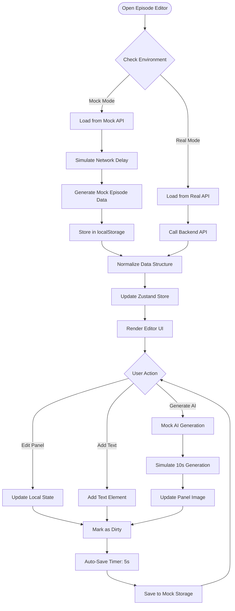

```typescript
// stores/editorStore.ts
import { create } from 'zustand';
import { api } from '@/lib/api/apiClient';
import toast from 'react-hot-toast';

interface EditorState {
  // Data
  episode: Episode | null;
  pages: Page[];
  panelsById: Record<string, Panel>;
  textElementsById: Record<string, TextElement>;
  charactersById: Record<string, Character>;
  
  // UI State
  selectedPanelId: string | null;
  selectedPageId: string | null;
  dirty: boolean;
  saving: boolean;
  loading: boolean;
  error: string | null;
  
  // Metadata
  lastSavedAt: string | null;
  
  // Actions
  loadEpisode: (episodeId: string) => Promise<void>;
  selectPanel: (panelId: string | null) => void;
  updatePanel: (panelId: string, updates: Partial<Panel>) => void;
  addPage: () => void;
  addPanel: (pageId: string) => void;
  addTextElement: (panelId: string, element: Omit<TextElement, 'text_id'>) => void;
  updateTextElement: (textId: string, updates: Partial<TextElement>) => void;
  deleteTextElement: (textId: string) => void;
  saveChanges: () => Promise<void>;
  generatePanel: (panelId: string, input: PanelGenerationInput) => Promise<void>;
}

export const useEditorStore = create<EditorState>((set, get) => ({
  // Initial state
  episode: null,
  pages: [],
  panelsById: {},
  textElementsById: {},
  charactersById: {},
  selectedPanelId: null,
  selectedPageId: null,
  dirty: false,
  saving: false,
  loading: false,
  error: null,
  lastSavedAt: null,
  
  // Load episode with all data
  loadEpisode: async (episodeId: string) => {
    set({ loading: true, error: null });
    
    try {
      console.log('📚 Loading episode:', episodeId);
      const data = await api.getEpisodeFull(episodeId);
      
      // Normalize data into flat structures
      const panelsById: Record<string, Panel> = {};
      const textElementsById: Record<string, TextElement> = {};
      
      data.pages.forEach((page) => {
        page.panels.forEach((panel) => {
          panelsById[panel.panel_id] = panel;
          
          panel.text_elements?.forEach((te) => {
            textElementsById[te.text_id] = te;
          });
        });
      });
      
      const charactersById = data.characters.reduce((acc, char) => {
        acc[char.character_id] = char;
        return acc;
      }, {} as Record<string, Character>);
      
      set({
        episode: data.episode,
        pages: data.pages,
        panelsById,
        textElementsById,
        charactersById,
        loading: false,
        dirty: false,
        lastSavedAt: new Date().toISOString(),
      });
      
      console.log('✅ Episode loaded successfully');
      toast.success('Episode loaded');
      
    } catch (error) {
      console.error('❌ Failed to load episode:', error);
      set({
        loading: false,
        error: error instanceof Error ? error.message : 'Failed to load episode',
      });
      toast.error('Failed to load episode');
      throw error;
    }
  },

  // The rest of the actions are added in Workflows 3.1B and 3.1C
}));
```